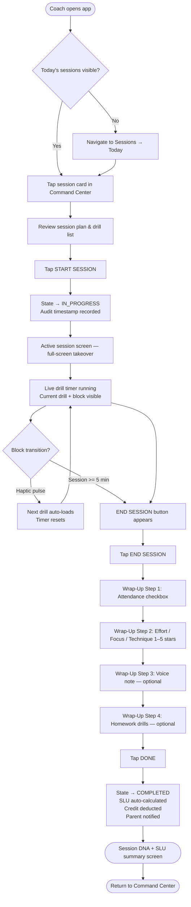
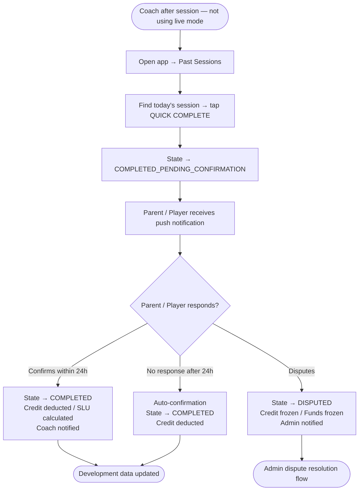
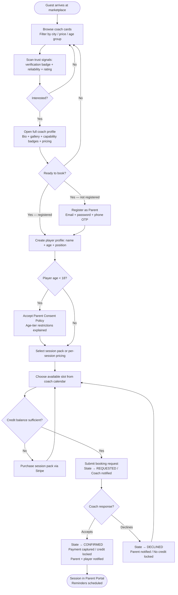
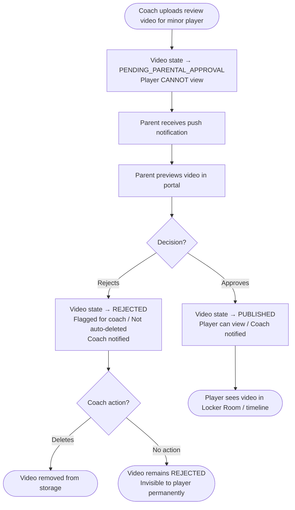
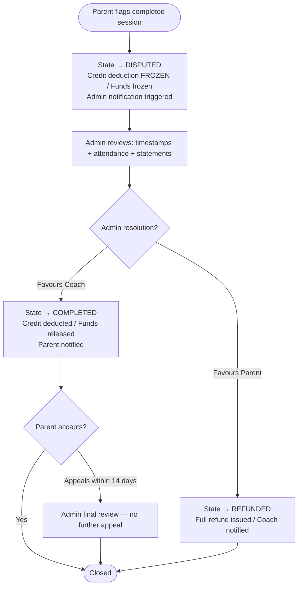

# UX Design Specification — Skillars

**Author:** Mbah
**Date:** 2026-06-09

---

<!-- UX design content will be appended sequentially through collaborative workflow steps -->

## Executive Summary

### Project Vision

Skillars is a two-sided marketplace and professional coaching platform for independent football coaches in Germany. It treats private coaching as a professional service — giving coaches a complete business operating system and giving families a permanent, portable record of their child's development. The strategic anchor is player data ownership: the longer a player uses the platform, the more irreplaceable their development history becomes.

MVP scope: Germany; EUR only; mobile-responsive web (no native app); Quasar/Vue 3 frontend conforming to the Skillars glassmorphism design system.

### Target Users

**Coach** — Independent solopreneur; mobile-first; works outdoor pitches. Needs a tool that manages bookings, payments, session planning, and client reporting without administrative overhead. Tech context: smartphone in hand on a muddy pitch, often one-handed.

**Parent** — Manages one or more minor player profiles under a single login. Handles all payments, booking requests, and consent flows. Wants proof that their child is developing, full visibility into communications, and clean logistics management.

**Player** — Age-tiered (U10 fully parent-managed → 18+ fully independent). Wants the "Pro Academy" experience: structured feedback, homework drills, and a visual skill growth narrative. Engagement is motivation-driven, not task-driven.

**Guest** — Unauthenticated visitor. Can browse the marketplace and view coach profiles. Cannot contact coaches or book. The marketplace UX must convert them.

**Admin** — Platform operator. Accesses moderation queues, dispute resolution, financial oversight, and coach verification from within the same frontend.

### Key Design Challenges

1. **The pitch-side constraint.** The session Start/End and 30-second wrap-up workflow must be completable in under 30 seconds, one-handed, on a mobile device outdoors (sun glare, mud, cold). This is the hardest usability constraint in the product.

2. **Multi-role complexity with shared data, different lenses.** Four user types share the same underlying data but need fundamentally different views. The same session data that is a "DNA analysis" for the coach is a "progress story" for the parent and a "skill level-up" for the player. The IA must serve each perspective without leakage.

3. **14-state booking machine, zero visible complexity.** The booking lifecycle has fourteen states. Users must only ever see clear, plain-language status indicators. State transitions must feel automatic and reassuring, never like a workflow to manage.

4. **Age-tiered safeguarding must feel invisible to children, transparent to parents.** Four age brackets (U10, 10–12, 13–17, 18+) enforce different messaging, video, and account rules. Restrictions must manifest as natural platform affordances — not error messages — and must be clearly surfaced to parents as protective features.

5. **Marketplace discovery vs. professional toolkit — two cognitive modes.** A guest browsing for a coach and a coach mid-session building a drill plan are in completely different mental states. The information architecture must support clean context switching between the public-facing marketplace and the private coaching workspace without confusion.

### Design Opportunities

1. **The pitch-side session moment as a signature experience.** The Start → Live Timer → End → 30-second Wrap-Up flow is the most differentiated UX in the product. Designed well for outdoor, one-handed, high-pressure use, it becomes a word-of-mouth moment coaches demonstrate to peers.

2. **The development narrative as the retention flywheel.** SLU + Skills Radar data, presented as a growth story rather than raw metrics, makes the player's development timeline feel like a football identity — irreplaceable and worth staying for.

3. **Coach Command Center as a business cockpit.** The weekly schedule view with projected revenue, schedule gaps, and client roster is an opportunity to make coaches feel like professional business owners, not just people with a calendar app.

4. **Trust signals as conversion mechanics.** Verification badges, capability badges, reliability scores, and star ratings on coach cards directly impact booking conversion. Designing these for 3-second scannability turns trust infrastructure into a growth lever.

5. **The Locker Room as the player's "home."** Homework drills with pro-demo loops and player upload capability — designed with energy and motivation — can drive daily active use from younger players and deepen family engagement.

---

## Core User Experience

### Defining Experience

The platform's value hinges on a single critical action: the coach completing a session. Session completion triggers credit deduction, SLU calculation, development data generation, wrap-up ratings, and homework assignment. Everything downstream — the development narrative, parent visibility, player progress — flows from this one moment. The entire UX must be optimised to make this action as frictionless as possible for a coach standing on a pitch.

### Platform Strategy

- **Platform:** Mobile-responsive web application (no native app at MVP)
- **Input model:** Touch-first for all coach flows (pitch-side, one-handed); keyboard/mouse supported for parent and admin flows typically performed at home or in an office
- **Device capabilities:** Camera and file upload (video homework/review); haptic feedback for session state transitions
- **Connectivity:** 4G assumed; no offline requirement at MVP
- **Reactive UI:** Video pipeline status must update without page reload

### Effortless Interactions

The following actions must require zero conscious thought:

- **Session start/end:** Maximum two taps, under 3 seconds each, reachable with one thumb
- **30-second wrap-up:** Three star-rating rows + one attendance checkbox — not a form, a quick-fire sequence
- **Booking request:** Parent selects slot → one tap → submitted. Credit balance always visible before this action, never buried in a sub-menu
- **Timezone display:** Automatic Pitch Timezone rendering — no user configuration needed, no mental timezone conversion ever required
- **Video status:** Reactive cards update SCANNING → TRANSCODING → PUBLISHED without reload
- **Parental video approval:** Push notification → one-tap approve or reject

### Critical Success Moments

| Moment | Who | What makes it succeed |
|---|---|---|
| First session completion | Coach | The wrap-up summary shows Session DNA and SLU breakdown — coach sees the professional value instantly |
| First PDF report | Parent | Downloads it, sees the radar improvement with baseline vs. current. Justifies the cost |
| First Locker Room visit | Player | Assigned homework drill is there; pro demo autoplays. Feels like "Pro Academy" |
| Marketplace conversion | Guest | Finds a coach, reads badges + reliability score, submits booking in under 3 minutes |
| First Command Center view | Coach | Sees projected weekly revenue + client roster. The "I'm a business owner" moment |

### Experience Principles

1. **Pitch-first, screen-second.** Every interface decision is judged against whether a coach could execute it one-handed in 30 seconds outdoors. Pitch-side flows fail if they require two hands, multiple taps, or reading.

2. **Data tells stories, not tables.** Development metrics lead with narrative ("Your weak foot exposure increased 42% this month") before numbers. A parent should feel proud, not confronted with a spreadsheet.

3. **Role clarity over feature density.** Each user type must feel the app was built for them alone. Coaches don't encounter parental approval queues. Players don't see revenue dashboards. Role contamination erodes trust in the product.

4. **Trust is visible, not implied.** Verification badges, capability badges, reliability scores, and safeguarding indicators are surfaced proactively in context. Users never need to hunt for trust signals.

5. **Complexity lives in the backend, not the UI.** The 14-state booking machine, SLU calculations, quota management, and age-tier enforcement are invisible to users. They experience outcomes — clear status labels, graceful gates, automatic confirmations — never the machinery behind them.

---

## Desired Emotional Response

### Primary Emotional Goals

**Coach — Empowered & Professional**
The coach must feel like a business owner, not someone filling in forms. The Command Center, the 30-second wrap-up, and branded PDF reports all communicate the same message: "You are a serious professional with serious tools."

**Parent — Reassured & Proud**
Two emotions in tension that must coexist. Reassured: the parent sees every message, approves every video, and knows their child's data is protected. Proud: the PDF report and Skills Radar improvement are proof worth sharing. Neither emotion can undermine the other.

**Player — Motivated & Recognised**
The platform must feel like a Pro Academy. The player feels seen (a coach rated their effort, tracked their weak foot) and driven (skill score improved — they want more). This is motivation by identity, not obligation.

**Guest — Intrigued & Trusting**
The marketplace triggers curiosity (this coach looks genuinely impressive) and immediately resolves doubt (Trusted tier, 4.9 stars, zero reliability issues). Both must happen without the guest having to work for it.

### Emotional Journey Mapping

| Stage | Coach | Parent | Player |
|---|---|---|---|
| Discovery | Intrigued — "This looks serious" | Hopeful — "This might show real progress" | Excited — "This is what the pros use" |
| Onboarding | Empowered — "My profile looks like a real business" | Reassured — "I'm in control" | — |
| First action | Relieved — "That wrap-up took 20 seconds" | Expectant — "Let me see what happened" | Curious — "My homework is here" |
| First insight | Proud — "My client's radar is moving" | Proud — "This report is shareable" | Driven — "My weak foot went up 6 points" |
| Daily use | Efficient — "I know my week at a glance" | Calm — "Everything is under control" | Motivated — "I want to do my homework" |
| Error state | Protected — "The audit trail proves my case" | Protected — "The dispute is fair" | — |

### Micro-Emotions

- **Confidence over Confusion:** Booking status labels must always be plain English. No user ever reads "PAYMENT_PENDING" — they read "Waiting for payment confirmation."
- **Trust over Scepticism:** Verification and capability badges must form a trust judgment in 3 seconds. Guests should not need to read to decide.
- **Accomplishment over Frustration:** The 30-second wrap-up ends with a satisfying summary screen. The coach feels *done*, not redirected into nothing.
- **Pride over Anxiety:** PDF reports and radar charts lead with improvement, not data. A parent opens a report and feels something before they read anything.
- **Belonging over Isolation:** Structured drill blocks, professional demos, radar charts, and the "Pro Academy" framing give the player an identity beyond their backyard. Solo training should feel like part of something real.

### Design Implications

| Emotion target | UX design approach |
|---|---|
| Coach empowerment | Command Center leads with revenue and schedule, not tasks. Wrap-up is a sequence of quick taps, not a form |
| Parent reassurance | Safeguarding indicators (visible message access, approval queue) are prominently surfaced, not hidden in settings |
| Player motivation | Skills Radar uses "level-up" language and progress deltas. Homework drills autoplay — no friction to start |
| Guest trust | Coach cards display trust tier and reliability score above the fold. No hunting required |
| Universal calm | Loading states, video pipeline transitions, and booking confirmations all have clear visual feedback — no ambiguous waiting |

### Emotional Design Principles

1. **Lead with the outcome, not the process.** Show coaches their weekly revenue before their task list. Show parents the skill improvement before the session log. The emotional payoff comes first.

2. **Make restrictions feel like care, not walls.** Age-tier safeguarding limits must be framed as protective features for parents and natural platform boundaries for players — never as error states or access denials.

3. **Earn pride at every milestone.** First session completion, first report generated, first homework submitted — each deserves a moment of recognition. No milestone passes silently.

4. **Design for recovery without shame.** Error states, disputes, and declined bookings must communicate what happens next in a calm, clear, and forward-looking tone. No blame language. No dead ends.

5. **Effortless = trustworthy.** When a flow feels smooth and fast, users extend trust to the product. When it feels clunky or slow, they question whether their data and money are safe. Performance and interaction quality are emotional design choices.

---

## UX Pattern Analysis & Inspiration

### Inspiring Products Analysis

**EA Sports FC / FIFA — Skills Radar as a Player Card**
The FIFA player card (PAC, SHO, PAS, DRI, DEF, PHY ratings on a 1–99 scale) is the exact mental model Skillars' Skills Radar maps to. Players and parents already understand this framing intuitively. The card format, colour tiers, and growth delta ("your DRI went from 58 to 64") is the reference aesthetic for the development intelligence UI. It makes abstract coaching data feel like a real identity artifact.

**Uber Driver App — One-Tap Pitch-Side Workflow**
The Uber Driver experience is the closest existing model to the coach's session management problem: one-handed, outdoors, under time pressure, with large tap targets, haptic feedback on state transitions, and minimal surrounding UI at the critical moment (Start Trip / End Trip). The wrap-up (rating + notes after drop-off) is structurally identical to Skillars' 30-second wrap-up. Lesson: oversized primary actions, no navigation during the active flow, immediate visual confirmation.

**Airbnb — Trust Architecture on Marketplace Cards**
Airbnb solves the "should I trust this stranger?" problem at card level — Superhost badge, star rating, review count, and verified status all land before the guest reads the bio. A trust judgment forms in 2 seconds. This is the exact problem Skillars' coach cards face. Verification tier + capability badges + reliability score must be scannable above the fold, not discovered by scrolling.

**Strava — Activity Data as Personal Identity and Narrative**
Strava turns raw metrics into achievement stories ("Your fastest 5K this month"). The activity feed is a timeline of who you're becoming, not a spreadsheet. This is the model for Skillars' player development timeline — not "Session 14: 85 SLU", but "Your weak foot training increased 42% this month. You're in your best stretch yet."

**ClassDojo — Child Safety Communication as a Positive Feature**
ClassDojo makes parental visibility into school communication feel like an inclusion feature ("you're always in the loop") rather than surveillance. Skillars must adopt the same framing: parental visibility into coach-player messages is a protective benefit, never a monitoring mechanism.

**Stripe Dashboard — Financial Complexity for Non-Accountants**
Stripe breaks down gross revenue, processing fees, platform commission, and net payout into plain-language labelled line items. A non-accountant understands their money in 10 seconds. Skillars' coach revenue dashboard must follow the same pattern: clear labels, progressive detail (summary first, breakdown on tap), no accounting jargon.

### Transferable UX Patterns

| Category | Pattern | Apply to Skillars |
|---|---|---|
| **Navigation** | Role-specific entry points | Each user type lands in their own context — Coach Command Center, Parent Portal, Player Locker Room — never a generic dashboard |
| **Navigation** | Bottom nav with 4–5 role-scoped destinations | Coach: Sessions / Clients / Library / Revenue. Parent: Sessions / Progress / Messages / Payments |
| **Interaction** | Oversized single-action button during active flow (Uber Start/End Trip) | Session Start and End buttons are full-width, high contrast, always reachable with one thumb |
| **Interaction** | Star-rating wrap-up in 3 taps | Effort / Focus / Technique as a quick-fire horizontal sequence, not dropdowns |
| **Visual** | Stat card with delta (EA FC player card) | Skills Radar node shows current score + baseline delta ("↑ +6 since first assessment") |
| **Visual** | Trust signal hierarchy on marketplace cards (Airbnb) | Verification tier badge + capability badge row on coach card, above the fold |
| **Visual** | Achievement narrative over raw data (Strava) | Development insight cards lead with the narrative, collapse to raw numbers |
| **Onboarding** | Progressive disclosure — show value before full feature set | Coach onboarding completes one step at a time; Command Center populates as data arrives |

### Anti-Patterns to Avoid

1. **Generic calendar grid as the primary scheduling UI.** A standard month/week grid doesn't communicate schedule gaps, projected revenue, or client roster at a glance. The Coach Command Center needs a purpose-built layout.

2. **Multi-step modals for pitch-side actions.** Any confirmation dialog requiring more than one tap between "I want to start the session" and "session started" is fatal for outdoor mobile use.

3. **Dashboard-first onboarding with empty states everywhere.** Showing coaches a full Command Center with zero data creates overwhelm and no perceived value. Progressive disclosure tied to milestones is the right model.

4. **Contact detail filtering as a surprise error.** The platform redacts contact details from free text. This must be a visible, friendly policy notice at the point of input — not a post-submission surprise.

5. **Buried safeguarding controls.** Parental visibility settings, age-tier restrictions, and video approval queues must be first-class UI — not three levels deep in account settings.

### Design Inspiration Strategy

| Direction | Pattern | Rationale |
|---|---|---|
| **Adopt** | EA FC stat card framing for Skills Radar | Players and parents already understand it; makes data feel like identity |
| **Adopt** | Airbnb trust signal hierarchy on coach cards | Proven marketplace trust pattern; maps directly to verification + badges |
| **Adopt** | Uber Driver oversized action + haptic on state change | Closest existing model to pitch-side session management |
| **Adopt** | Strava narrative-first data presentation | Aligns with "data tells stories, not tables" experience principle |
| **Adapt** | ClassDojo parent-child visibility model | Keep the "you're included" tone; adapt for sports coaching context |
| **Adapt** | Stripe financial dashboard hierarchy | Adapt labels for coaching context (sessions vs. transactions) |
| **Avoid** | Generic calendar grid as Command Center | Doesn't surface revenue/gaps; requires a purpose-built layout |
| **Avoid** | Multi-step confirmation modals | Fatal for pitch-side use; one primary action per screen at session time |
| **Avoid** | Dashboard-first onboarding with empty states | Progressive reveal tied to coach milestones instead |

---

## Design System Foundation

### Design System Choice

**Custom Skillars Design System v2 — built on Quasar + Vue 3**

Mandated by FR-UI-001. All frontend screens must conform to the Skillars Design System defined in `requirements/skillars/ui-design_v2.md`. This is a non-negotiable constraint, not a decision made in this UX workflow.

### Rationale for Selection

The system already exists as a mature, production-ready specification. It provides glassmorphism dark/light mode tokens, Inter typography scale, 4px spacing rhythm, a 3-column desktop grid, and WCAG AA accessibility compliance requirements. Using it ensures visual consistency and eliminates design-token decisions from screen-level work.

### Implementation Approach

| Element | Specification |
|---|---|
| Framework | Quasar 2.16 + Vue 3.5 (`<script setup>`) |
| Aesthetic | Glassmorphism; dark futuristic sports analytics |
| Default mode | Dark mode primary; light mode fully accessible alternative |
| Mode switching | CSS custom properties only — never `isDark` checks in component logic |
| Typography | Inter; weights 400–800 |
| Spacing | 4px base unit; scale: 4, 8, 12, 16, 24, 32, 48px |
| Layout | Max-width 1450px; desktop 3-col (320px / 1fr / 320px); 24px gap |
| Colour | All values via CSS custom property tokens — zero hardcoded hex |
| Accessibility | WCAG AA in both modes; 44px minimum touch targets |

### Customization Strategy

The design system provides the token vocabulary and component primitives. This UX specification defines how those tokens are assembled per screen. New composition patterns required beyond the existing system:

- **Coach Command Center** — purpose-built scheduling + revenue layout
- **Session active state** — oversized pitch-side controls (Start/End buttons)
- **Skills Radar display** — EA FC-inspired stat card with delta indicators
- **Marketplace coach cards** — trust signal hierarchy composition
- **Player Locker Room** — motivational drill card layout with autoplay
- **30-second wrap-up** — quick-fire haptic interaction sequence

**Hard constraints to carry into every screen design:**
- Every screen validated in both dark and light mode before sign-off
- All colours via `var(--token-name)` — zero exceptions
- No `isDark` logic in any component
- Minimum 44px touch targets on all interactive elements

---

## Defining Experience

### The Core Interaction

> *"Tap Start. Coach your player. Tap End. Rate them in 30 seconds. Watch their development record update automatically."*

The singular act of completing a session — through a one-handed 30-second wrap-up — is the trigger for every downstream value: SLU calculation, Skills Radar feed, parent timeline update, session DNA analysis, homework assignment, and payment confirmation. Nothing else in the platform delivers value without this moment happening first.

### User Mental Model

| User | Current approach | Mental model they bring | What Skillars replaces |
|---|---|---|---|
| **Coach** | Mental notes, WhatsApp, cash | "I check in like Uber, I rate like a delivery app" | The coach's mental note → structured 30-second wrap-up |
| **Parent** | Asking the coach verbally | "Like a school progress report, but live" | The verbal "he's improving" → Skills Radar with data |
| **Player** | Nothing — they just trained | "Like my FIFA card, but real" | Zero → an actual identity with growing stats |

**Likely confusion points:**
- SLU (automatic training volume) vs. Skills Radar (coach-assessed ability) — two separate systems that look similar. The UI must make this distinction clear without explaining it.
- Session packs vs. per-session payment — two coexisting models. Parents must know which applies before booking.
- Age-tier restrictions surfacing unexpectedly — must be a natural platform boundary, not an error state.

### Pattern Analysis

The individual patterns are all familiar. The novel part is the chain: session wrap-up → automatic SLU calculation → radar feeds → timeline update → parent visibility. No existing product does this end-to-end. Each step maps to something users already know:

- Session check-in: Uber/Swarm (tap to start)
- Wrap-up rating: Uber/Deliveroo (quick post-action star rating)
- Drill library: Nike Training Club (curated pro content)
- Development tracking: EA FC + Strava (stat card + narrative)
- Marketplace booking: Airbnb/Calendly (trust + frictionless request)

The education needed is minimal — each step maps to something users already do.

### Experience Mechanics

**1. Initiation**
- Coach opens Command Center; today's session card is prominent — player name, time, planned drills
- "Start Session" is a full-width, high-contrast button, bottom of screen, reachable with one thumb
- No navigation required to reach it from the app home

**2. Active Session**
- State transitions to `IN_PROGRESS`; timestamp recorded for audit trail
- Live view: current drill name + countdown timer, next drill name preview
- Haptic pulse at block transitions (Warm-Up → Technical → Game Intensity → Cool-Down)
- "Skip drill" and "+2 min" are deliberately small and out of thumb's easy path — available but don't invite accidental taps
- Display: maximum contrast, Inter 700+ for active text, no elements under 44px

**3. End Session**
- "End Session" button suppressed for the first 5 minutes (prevents accidental end)
- After 5 minutes: full-width button appears — same visual weight as Start
- One tap → haptic confirmation → wrap-up begins immediately (no intermediate screen)

**4. 30-Second Wrap-Up**

| Step | Time | Interaction |
|---|---|---|
| Attendance | 3 sec | Single large checkbox — "Player was present" |
| Ratings | 10 sec | Three rows: Effort / Focus / Technique — tap a star (1–5), auto-advance |
| Voice note | 10 sec | Optional — microphone button; skip equally prominent |
| Homework | 7 sec | Optional — shows 2 most relevant drills; tap to assign or skip |
| Done | tap | "Done" → summary screen |

**5. Summary Screen**
- Session DNA mini-radar (today's balance across 5 dimensions)
- SLU headline: "64 weak-foot contacts · 38 first-touch reps · 51 physicality reps"
- "Development record updated" indicator — parent notified
- Natural exit back to Command Center

### Success Criteria

- 90% of coaches complete wrap-up in under 60 seconds (target: 30)
- Zero steps in the active session flow require two hands
- Summary screen communicates measurable value before coach closes it
- Session completion rate (started → completed) > 95%

---

## Visual Design Foundation

### Color System

The Skillars color system uses CSS custom property tokens that swap automatically between dark and light mode. All components reference tokens — never hardcoded hex values.

| Token role | Dark value | Light value | UX use |
|---|---|---|---|
| `--bg-primary` | `#0b1020` | `#f0f4f8` | Page backgrounds; never pure black/white |
| `--accent-primary` | `#00ffb4` neon green | `#007a58` forest green | CTAs, active states, progress, success |
| `--accent-secondary` | `#0088ff` electric blue | `#1563c4` navy blue | Links, secondary actions, charts |
| `--accent-danger` | `#ff5f7a` coral | `#d0294a` crimson | Destructive actions, disputes, no-shows, strikes |
| `--accent-warning` | `#ffb84d` amber | `#c07a00` dark amber | Quota warnings, neglected skill alerts, reminders |
| `--hero-gradient` | `#00ffb4 → #0088ff` | `#007a58 → #1563c4` | Skills Radar scores, SLU headlines, revenue totals |
| `--surface-glass` | `rgba(255,255,255,0.04)` | `rgba(255,255,255,0.72)` | All cards, panels, sidebars |

**Critical colour rules:**
- Neon accents (`#00ffb4`, `#0088ff`) are forbidden on light backgrounds — they fail WCAG AA. Token system handles this automatically; no component may hard-code neon hex values.
- `--accent-danger` is reserved exclusively for destructive/high-stakes states: cancelled sessions, disputes, no-shows, reliability strikes, suspension. Never for general warnings.
- `--accent-warning` for non-critical alerts: quota approaching limit, session reminder, neglected skill flag.
- Hero gradient applied to: Skills Radar scores, SLU headlines, projected revenue, session DNA summary — the "achievement" moments. Not for body text or navigation.
- Pitch-side session screen: Start/End button uses `--accent-primary` fill — the highest-contrast tap target on screen for outdoor readability.

### Typography System

Font: Inter (weights 400, 500, 600, 700, 800). Single typeface — no secondary font.

| Role | Size | Weight | Used for |
|---|---|---|---|
| Hero Metric | 56–72px | 800 / gradient text | Skills Radar headline score, weekly revenue total, SLU count |
| Page Title | 28–36px | 700 | Screen titles (Command Center, Player Portal, Locker Room) |
| Section Title | 18–22px | 700 | Card headings, section dividers |
| Card Title | 16–18px | 700 | Session cards, player names, drill titles |
| Body | 14–16px | 400 / line-height 1.6 | Coach bio, session notes, message threads |
| Metadata | 12–13px | 500 / letter-spacing 0.3px | Timestamps, durations, SLU breakdowns |
| Label | 11–13px | 600 / UPPERCASE / 0.5px | Status chips (CONFIRMED, DISPUTED), badge labels |

**Pitch-side override:** On the active session screen, the current drill name and block timer use Section Title scale minimum (18px/700). Outdoor readability requires larger scale even for content that would normally be body text.

### Spacing & Layout Foundation

**Spacing scale (4px base unit):**

| Value | Name | Use |
|---|---|---|
| 4px | micro | Icon-to-label gaps, badge inner padding |
| 8px | small | Stacked metadata rows, tight list items |
| 12px | compact | Dense information blocks (quota bars, SLU rows) |
| 16px | standard | Default card inner padding, form field gaps |
| 24px | section | Column gaps, between-card spacing |
| 32px | large | Between major screen sections |
| 48px | hero | Marketplace hero section vertical rhythm |

**Layout by context:**

| Context | Layout | Rationale |
|---|---|---|
| Desktop dashboards | 320px / 1fr / 320px | Left: nav + client list; Centre: content; Right: context panel |
| Tablet | Single column, full-width cards | Sidebars collapse; content stacks |
| Mobile pitch-side | Single column; bottom action bar | Primary actions always thumb-reachable at bottom |
| Mobile parent/player | Single column; scrollable card stack | Natural phone browse pattern |
| Active session screen | Full-screen takeover | No nav, no distractions; single-purpose |

**Component dimensions:**
- Cards: `.glass-card` — border-radius 28px, `backdrop-filter: blur(18px)`
- Buttons: height 40/44/48px, border-radius 14px, never sharp corners
- Modals: border-radius 24–32px, blurred backdrop
- Progress bars: height 8–10px, border-radius 999px
- Avatars: 88–96px square, border-radius 24px
- Sidebar: 280px, icon-first navigation

**Motion:** Standard `all 0.2s ease` on cards/buttons/nav. Hover lift `translateY(-2px)`. No animations > 300ms.

### Accessibility Considerations

- WCAG AA contrast required in both dark and light modes — no exceptions, including chart labels and metadata
- 44px minimum touch targets on every interactive element
- Focus states use `--accent-primary` outline (legible in both modes via token)
- Progress bars and chart colours always paired with a label or icon — never colour-only encoding
- Neon accent colours (`#00ffb4`, `#0088ff`) never appear on light backgrounds — enforced by token system

---

## Design Direction Decision

### Design Directions Explored

Six directions were generated and are available as an interactive showcase at `_bmad-output/planning-artifacts/ux-design-directions.html`. Each uses the actual Skillars token values.

| Direction | Screen | Approach |
|---|---|---|
| **A — Spatial Dashboard** | Coach Command Center | 3-column desktop shell; sidebar nav + client list; centre for schedule; right panel for revenue and metrics |
| **B — Content Stream** | Coach home | Minimal icon rail; chronological activity feed; one-tap action per item; optimised for quick scanning |
| **C — Pitch Focus** | Active session | Full-screen takeover; 72px gradient timer; 42px drill name; block progress pips; suppressed End button for 5 min |
| **D — Parent Portal** | Development dashboard | Player profile + Skills Radar with score deltas; session pack tracker; chronological development timeline |
| **E — Marketplace** | Coach discovery | Search + filter chips; 3-column coach card grid; trust signals (verification badge, capability icons, reliability) above the fold |
| **F — Wrap-Up Flow** | Post-session wrap-up | Phone mockup; step-pip progress; attendance → star ratings → voice note → homework; Session DNA + SLU summary |

### Chosen Direction

**Context-appropriate composition — one design language, six optimised contexts.**

Since Skillars serves radically different user contexts (a coach on a pitch vs. a parent at home vs. a guest browsing), the design decision is not a single direction for the entire product but a context-matched composition:

| Context | Direction applied | Rationale |
|---|---|---|
| Coach desktop | Direction A (3-column) as shell | Maximum information density; spatial hierarchy for revenue + schedule + clients simultaneously |
| Coach mobile home | Direction B (content stream) | One-tap actions; activity-first; natural for quick mobile checks |
| Active session (pitch-side) | Direction C (pitch focus) | Non-negotiable; full-screen takeover; all other chrome removed |
| Parent / Player portal | Direction D (development focus) | Story-first data presentation; radar + timeline as the hero |
| Marketplace (guest) | Direction E (coach card grid) | Trust signal hierarchy; conversion-optimised card composition |
| Wrap-up sequence | Direction F (phone-native) | 4-step mobile sequence; phone mockup interaction pattern |

### Design Rationale

- The Skillars design system tokens (glass cards, neon accents, hero gradient) are consistent across all directions — the visual identity is unified.
- Layout and information density adapt to the user's context and device, not to a single fixed template.
- Direction C (pitch-side) is the highest-stakes screen and deliberately sacrifices dashboard density for one-handed outdoor legibility — this is a deliberate asymmetry in the product.
- Direction E (marketplace) prioritises trust conversion: verification tier and reliability score are the first things a guest reads on a coach card, before price or bio.

### Implementation Approach

Each major user context will be designed as a dedicated screen composition. Shared components (glass cards, buttons, badges, progress bars) come from the design system. The layout grid and information hierarchy are context-specific per the direction table above. No single template is reused across all contexts.

---

## User Journey Flows

### Journey 1: Session Lifecycle — Live Mode (Coach)

The defining experience. Every downstream value (SLU, Skills Radar feed, parent timeline, credit deduction) depends on this completing successfully.



### Journey 2: Quick Complete Mode (Coach)

Alternative path for coaches who do not use live tracking. Parent confirmation is a mandatory gate before credit deduction.



### Journey 3: Guest → Coach Discovery → Confirmed Booking (Parent)

Full acquisition and conversion flow from marketplace entry to confirmed session.



### Journey 4: Parent Video Approval — Minor Player Safeguarding

Triggered whenever a coach uploads or tags a video for a player under 18.



### Journey 5: Dispute Resolution

Triggered when a parent flags a completed session.



### Journey Patterns

**Entry pattern — context-first landing:** Every role lands on their own screen with today's most important action surfaced immediately. No generic empty dashboard.

**State transition pattern — plain language always:** Every state transition communicates in plain English to the user. State changes trigger push notifications with plain-language summaries.

**Gate pattern — block with explanation and next action:** Hard gates (no credits, minor restrictions, tier limitation) always explain the reason and provide a path forward. Never a dead end.

**Confirmation pattern — summarise before committing:** Any irreversible action shows a summary before the final commit tap.

**Recovery pattern — forward momentum:** Declined bookings, rejected videos, and failed payments return the user to the nearest useful next step — not the app home.

### Flow Optimisation Principles

- Session wrap-up is 4 steps maximum. No optional step adds a new screen — it adds a secondary action within the current screen.
- Booking request is 3 taps from slot selection to submitted state.
- Video approval is a single-screen decision — preview + approve/reject in one view.
- Dispute flow is entirely admin-driven after the parent initiates — the parent takes one action and the platform handles the rest.
- Every flow involving a minor player has the parent as the decision-maker.

---

## Component Strategy

### Design System Components

Quasar provides all structural primitives. The Skillars design system tokens (border-radius overrides, glass surfaces, colour tokens) are applied via SCSS to create the final visual style.

| Quasar component | Skillars usage |
|---|---|
| `q-card` | Base for all `.glass-card` surfaces |
| `q-btn` | All buttons (border-radius 14px + height 40/44/48px overrides) |
| `q-input` / `q-select` | All form fields |
| `q-dialog` | Modals (border-radius 24–32px, blurred backdrop) |
| `q-tabs` | Navigation tabs in dashboards and portals |
| `q-drawer` | Sidebar (280px, icon-first) |
| `q-linear-progress` | Progress bars (height 8–10px, border-radius 999px) |
| `q-avatar` | Player and coach avatars (88–96px, border-radius 24px) |
| `q-badge` | Notification counts |

### Custom Components

Quasar covers structural primitives. None of Skillars' domain-specific UI concepts are addressable by generic components. The following custom components are required:

#### `CoachCard`
**Purpose:** Marketplace coach listing. Must communicate trust in 3 seconds.
**Anatomy:** Avatar (gradient) · Name + location · VerificationBadge · CapabilityBadgeSet · Star rating + review count · ReliabilityIndicator · Price
**States:** Default · Hover (translateY -2px) · Skeleton loading
**Key constraint:** Trust signals (verification tier, reliability) appear above price — never below it.

#### `SkillsRadarChart`
**Purpose:** Interactive 15-skill radar showing current ability vs. baseline. The player's "FIFA card."
**Anatomy:** SVG polygon on concentric circles · Per-node labels · Score badge · Delta indicator ("↑ +6 since first assessment") · Confidence dot · Last-updated tooltip
**Variants:** Full 15-skill · Coach-selected subset (geometry adjusts dynamically)
**Accessibility:** All node values readable as text; chart is supplementary, not the sole data source.

#### `SessionDNAChart`
**Purpose:** 5-dimension session balance radar (Technical / Physical / Cognitive / Match Realism / Weak Foot). Used in wrap-up summary and session cards.
**Variants:** Full-size (wrap-up summary) · Compact thumbnail (session card)

#### `ActiveSessionScreen`
**Purpose:** Full-screen pitch-side session management. The most critical UI in the product.
**Anatomy:** Live indicator + elapsed time · Block progress pips (4 segments) · Block label · Current drill name (42px/800) · Countdown timer (72px gradient) · Next drill preview · Skip / +2min (small, secondary) · END SESSION (full-width, appears after 5 min)
**Hard rules:** No navigation chrome. No distracting elements. One primary action always visible.

#### `WrapUpSequence`
**Purpose:** 4-step post-session flow. Must complete in 30 seconds one-handed.
**Step structure:** Step pip indicator → Attendance checkbox → Three-row star ratings (auto-advance on 5th star) → Voice note button + skip → HomeworkDrillPicker + skip → DONE
**Rule:** Optional steps have equal visual weight for skip vs. complete — no step feels mandatory beyond attendance.

#### `BookingStateChip`
**Purpose:** Maps all 14 internal booking states to plain-English labels with colour coding.

| Internal state | Display label | Colour token |
|---|---|---|
| `REQUESTED` | Awaiting coach response | `--accent-warning` |
| `CONFIRMED` | Confirmed | `--accent-primary` |
| `IN_PROGRESS` | Session in progress | `--accent-secondary` |
| `COMPLETED` | Completed | `--accent-primary` muted |
| `DISPUTED` | Under review | `--accent-danger` |
| `CANCELLED_COACH` | Cancelled by coach | `--accent-danger` |
| `REFUNDED` | Refunded | `--text-muted` |

#### `SessionPackTracker`
**Purpose:** Visual session credit display. Always visible before booking.
**States:** Healthy (>30% remaining) · Warning (<30%, amber) · Critical (1–2 left, amber + CTA) · Exhausted (red + "Buy sessions" CTA)

#### `VideoStatusCard`
**Purpose:** Reactive card updating pipeline state without page reload.
**States:** `PENDING` → `SCANNING` → `TRANSCODING` → `PUBLISHED` → `LOCKED` → `REJECTED`
**Each state has a distinct visual treatment:** spinner, moderation indicator, progress bar, thumbnail, padlock overlay, warning overlay respectively.

#### `DrillCard`
**Purpose:** Drill library card for Session Builder, Locker Room, and Homework Picker. Mobile-first.
**Anatomy:** 15-second silent autoplay video loop · Drill name + difficulty badge · Equipment icons · Coaching points (3–4 bullets) · SLU estimate chip · Weak-foot bias indicator · Primary action (Add / Assign)

#### `ReliabilityIndicator`
**Purpose:** Plain-language trust signal on coach cards and profiles.
**Logic:** 0 issues → green "No reliability issues" · 1–2 → amber "X issues (90 days)" · 3+ → red "Review reliability score". Zero issues displays a positive label — not silence.

#### `ParentChildSwitcher`
**Purpose:** Switch between multiple player profiles without logout.
**Anatomy:** Current player avatar + name in header → tap → drawer showing all family profiles → one-tap switch, page context reloads for selected player.

#### `QuotaUsageBar`
**Purpose:** Visualise storage and bandwidth quota consumption against the user's tier limit; surfaces upgrade prompts when approaching ceiling.
**Used in:** Player Portal video management screen (Epic 5), Video Management page (Epic 6).
**Anatomy:**
- Two labelled rows: "Storage" (used GB / total GB) and "Bandwidth" (used GB / monthly limit)
- Each row: label · filled progress bar · numeric summary (e.g., "3.2 GB / 5 GB") · tier limit label (e.g., "Instructor Plan — 5 GB")
- Progress bar fill: default accent token up to 80%; `--color-warning` token from 80–94%; `--color-error` token at 95%+
- At 95%+: inline one-line prompt "Running low — upgrade for more space" linking to subscription upgrade flow
**States:** normal · warning (>80%) · critical (>95%) · loading skeleton
**Behaviour:** Data from `GET /api/video/quotas/me`; re-fetches after any upload or delete event via `video.store.js` (event-driven, no polling).
**Constraints:** All colours via CSS custom property tokens only — no hardcoded hex. WCAG AA contrast required in both dark and light mode.

### Component Implementation Strategy

- All custom components are built with Quasar primitives as the structural base
- All colours reference CSS custom property tokens — zero hardcoded hex values in any component
- All interactive elements maintain 44px minimum touch target
- Every component validates in both dark and light mode before sign-off
- Reactive state updates (VideoStatusCard, BookingStateChip) use Vue reactivity — no page reloads

### Implementation Roadmap

**Phase 1 — Session lifecycle (core value delivery):**
`ActiveSessionScreen` · `WrapUpSequence` · `SessionDNAChart` · `BookingStateChip` · `SessionPackTracker`

**Phase 2 — Marketplace + Development Intelligence:**
`CoachCard` (composed with `VerificationBadge` + `CapabilityBadgeSet` + `ReliabilityIndicator`) · `SkillsRadarChart` · `DrillCard` · `VideoStatusCard`

**Phase 3 — Supporting flows:**
`QuotaUsageBar` · `HomeworkDrillPicker` (standalone; embedded version ships in Phase 1 WrapUpSequence) · `ParentChildSwitcher`

---

## UX Consistency Patterns

### Button Hierarchy

| Tier | Visual | Use |
|---|---|---|
| **Primary** | `--accent-primary` fill, border-radius 14px, height 44–48px | Session Start/End, booking submit, DONE, purchase CTA — one per screen |
| **Secondary** | Glass surface + `--border-medium`, same height | Contextual actions: Skip, +2 min, Cancel, Request change |
| **Destructive** | `--accent-danger` fill | Irreversible actions only: Delete video, Cancel session (with confirmation) |
| **Ghost** | Border-only, `--text-secondary` | Tertiary: Learn more, View details, Back |
| **Pitch-side override** | Primary full-width, min 56px height | Session screens only — outdoor legibility requires maximum tap target |

Rules: Maximum one primary button per screen. Destructive buttons never appear without a confirmation step. Disabled state uses `--text-disabled` opacity — never hides the button entirely.

### Feedback Patterns

| Type | Trigger | Visual |
|---|---|---|
| **Success** | Session completed, booking confirmed, payment received | `--accent-primary` toast + checkmark, 3-second auto-dismiss |
| **Error** | Payment failure, validation error, upload failed | `--accent-danger` inline adjacent to failing element; toast for async errors |
| **Warning** | Quota approaching, pack expiring, reliability strike | `--accent-warning` banner or inline chip — non-blocking |
| **Info** | Neutral notification, timezone mismatch | `--accent-secondary` toast, 4-second auto-dismiss |

**Timezone mismatch:** Non-blocking info bar on login if browser timezone differs from pitch timezone. Auto-dismisses after 8 seconds.

**Contact detail detection:** Real-time detection in any free-text field. Amber warning bar at field top: "Contact details will be removed on save." On save, redacted silently — never a blocking error.

### Form Patterns

- **Validation:** Inline on blur (not on submit). Error message directly below the failing field.
- **Required fields:** Asterisk label. On attempted submit with errors, page scrolls to first error — no full-page overlay.
- **Voice input:** Available as alternative on session notes and wrap-up voice note fields. Microphone button alongside text input.
- **OTP / phone:** Single input, auto-advance between digits, auto-submit on last digit.
- **Consent checkboxes:** Never pre-checked. Legal text must be scrollable before checkbox activates. No dark patterns.

### Navigation Patterns

**Role-specific bottom tab bars (mobile):**

| Role | Tabs |
|---|---|
| Coach | Sessions · Clients · Library · Revenue |
| Parent | Sessions · Progress · Messages · Payments |
| Player | Locker Room · My Skills · Sessions |

Desktop sidebar (Coach/Admin): 280px, icon-first, collapsed label on hover. Active item: `--accent-primary` dot + text colour. Back navigation: always a visible back arrow on detail screens. `ParentChildSwitcher` in header — always accessible, never buried.

### Modal and Overlay Patterns

- **Confirmation modals:** Glass card, border-radius 28px, blurred backdrop. Exactly two actions: primary confirm + ghost cancel.
- **Destructive confirmation:** `--accent-danger` confirm button. Explicit consequence displayed. Never vague.
- **Bottom sheets (mobile):** Filter panels, HomeworkDrillPicker, ParentChildSwitcher. Max 75% screen height. Drag-to-dismiss.
- **No full-page overlays for background operations.** Uploading, generating reports, sending notifications — the UI remains usable.

### Empty States

Every empty state: icon/illustration + headline + CTA. Never a bare empty list.

| Context | Headline | CTA |
|---|---|---|
| New coach — no clients | "Your first client is one session away" | Browse marketplace template |
| Coach — no sessions today | "A free day — plan tomorrow's sessions" | Open session builder |
| Parent — no upcoming sessions | "Ready to book your next session?" | Browse coaches |
| Player — no homework | "No homework yet — great job keeping up!" | *(no CTA needed)* |
| Drill search — no results | "No drills match those filters" | Clear filters |

### Loading States

- **Card grids / lists:** Skeleton cards matching exact dimensions of real cards.
- **Single item:** Centred spinner within the card boundary.
- **Upload progress:** Inline `q-linear-progress` within `VideoStatusCard`, labelled with current state.
- **Background operations:** SLU calculation, notifications, report generation — silent. User sees result, not processing.
- **Page transitions:** `all 0.2s ease` — no full-page loading spinners between routes.

### Age-Tier Restriction Pattern

- **Child-facing:** Restricted features are absent from the UI — not blocked, not error-styled. Invisible.
- **Parent-facing:** Actionable prompts for required parent actions. Positive framing: "Approve Luca's new video from Coach Marcus."
- **Age escalation (turning 18):** Parent-initiated consent flow to transition player to independent account. Not automatic.

### Tier Gating Pattern (Coach Subscriptions)

When a Scout-tier coach encounters an Instructor/Academy feature: a soft teaser overlay appears over a blurred feature preview. Copy states the benefit and the required tier. Single "Upgrade" CTA. The rest of the page remains fully usable — gating is never a full-screen block.

---

## Responsive Design & Accessibility

### Responsive Strategy

Skillars launches as a mobile-responsive web application only (no native app at MVP). All roles must be fully functional across all three breakpoints.

**Breakpoints (from ui-design_v2.md):**

| Breakpoint | Range | Primary users |
|---|---|---|
| Desktop | 1200px+ | Coaches planning sessions, Admin, Parents at home |
| Tablet | 768px–1199px | Mixed — all roles |
| Mobile | < 768px | Coaches on pitches, parents on the go, players |

**Layout by context and breakpoint:**

| Context | Desktop | Tablet | Mobile |
|---|---|---|---|
| Coach Command Center | 3-column (sidebar / schedule / revenue) | 2-column (icon rail / content) | Single column + bottom tabs |
| Parent Portal | 2-column (radar / sessions + timeline) | Single column | Single column |
| Marketplace | 3-column coach grid | 2-column grid | Single column cards |
| Active session | N/A (mobile only) | N/A | Full-screen takeover |
| Admin | 2-column (sidebar / content) | 2-column | Single column |

**Mobile-first rules:** Every component designed mobile-first. Bottom tab navigation on all mobile role views — no hamburger menus. All multi-column layouts collapse to single column at < 768px. Pitch-side buttons minimum 56px.

### Breakpoint Strategy

Mobile-first CSS approach. Media queries expand layout upward from the mobile base.

```scss
// Base styles are mobile
// Expand at 768px for tablet
@media (min-width: 768px) { ... }
// Expand at 1200px for desktop
@media (min-width: 1200px) { ... }
```

### Accessibility Strategy

**Standard: WCAG AA — mandatory for both dark and light modes** (FR-UI-001 requirement).

**Skillars-specific accessibility solutions:**

| Challenge | Solution |
|---|---|
| Skills Radar (SVG chart) | Accessible `<table>` with all 15 skill scores rendered alongside the SVG, visually hidden but screen-reader accessible |
| Colour-only state encoding | `BookingStateChip` always pairs colour with text label. Reliability indicators always include text. |
| Reactive content updates | `VideoStatusCard` and booking state changes use `aria-live="polite"` |
| Icon-only buttons | All icon-only buttons carry `aria-label` attributes |
| Silent drill videos | Descriptive `aria-label` and `title` on video elements; keyboard-accessible controls |
| Dynamic form validation | Error messages use `role="alert"` for immediate screen reader announcement |
| Colour blindness (deuteranopia) | `--accent-primary` (green) and `--accent-danger` (red) always paired with shape, icon, or label — never colour-only |

**Focus management:** After modal closes → focus returns to trigger element. After form submit → focus moves to success/error message. After wrap-up completes → focus moves to summary heading.

**Keyboard navigation:** All flows completable keyboard-only. Escape always closes overlays. Bottom sheets trap focus while open.

**Reduced motion:**
```css
@media (prefers-reduced-motion: reduce) {
  * { transition: none !important; animation: none !important; }
}
```

**Internationalisation:** `lang="de"` on German content, `lang="en"` on English. German locale for dates (`DD.MM.YYYY`, 24h time) and currency (`€65,00`). All ARIA labels in both languages.

### Testing Strategy

| Test | Method | When |
|---|---|---|
| Responsive layout | Chrome DevTools + physical devices (iPhone, Android, iPad) | Every screen before sign-off |
| Dark/light mode | Manual toggle | Every screen before sign-off |
| Keyboard navigation | Tab through every interactive flow | Every new component |
| Screen reader | VoiceOver (macOS/iOS), NVDA (Windows/Chrome) | Every major flow |
| Colour contrast | Axe / Lighthouse automated + manual for charts | Every screen |
| Colour blindness | Deuteranopia + protanopia simulation in DevTools | Every screen with colour-encoded state |
| Touch targets | Physical device testing + 44px audit | Every mobile screen |
| Reduced motion | Enable `prefers-reduced-motion` in OS | After motion implementation |

### Implementation Guidelines

**Component checklist — every new component must pass before sign-off:**
- [ ] Semantic HTML (`<button>` not `<div onclick>`, `<nav>`, `<main>`, `<section>`)
- [ ] `aria-label` on all icon-only interactive elements
- [ ] `aria-live` on all reactive content regions
- [ ] Focus indicator visible in both modes (`--accent-primary` outline, min 2px)
- [ ] Keyboard operable (Tab / Enter / Space / Escape / Arrow keys)
- [ ] WCAG AA contrast in both dark and light mode
- [ ] 44px minimum touch target on mobile
- [ ] `prefers-reduced-motion` respected
- [ ] `lang` attribute set correctly for bilingual content
